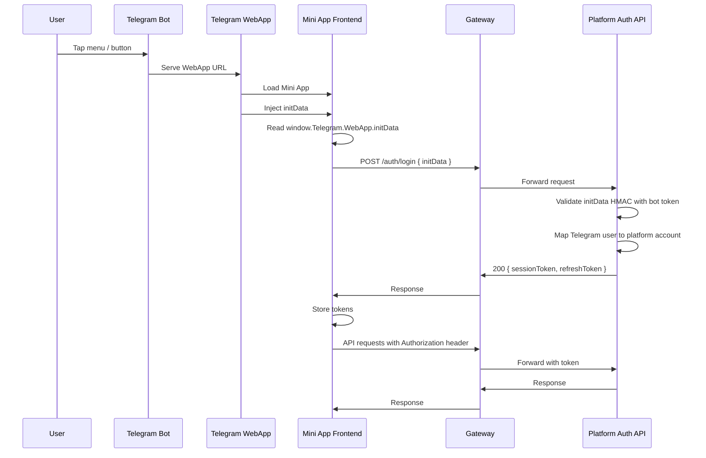

# Authentication and Security

## Role of Telegram Bot and WebApp

### Telegram Bot

- **Entry point** — User opens the Mini App from the bot (menu, button, or command)
- **WebApp URL** — Bot serves the Mini App URL; Telegram loads it in the WebApp view
- **Bot token** — Platform uses the bot token (secret) to validate `initData` HMAC; the app never sees the token

### Telegram WebApp

- **Runtime** — Hosts the Mini App inside Telegram (mobile or desktop)
- **initData** — Injects user identifier, auth hash, and optional profile data into the Web App
- **Theme and viewport** — Provides `themeParams`, viewport size, expand/ready APIs
- **No validation in client** — The app forwards `initData` to the platform; it does not validate it

## Telegram Authentication Sequence

Full flow from user opening the Mini App to authenticated API requests.

**Direct path (no Gateway):** When the Gateway is not deployed, Mini App sends `POST /auth/login` directly to Platform Auth API; subsequent requests go directly to Platform. Omit the Gateway participant in that case.

**Steps:**

1. User opens Mini App from bot (menu or button)
2. Telegram Bot serves the WebApp URL
3. Telegram WebApp loads the Mini App; Telegram injects `initData`
4. Mini App reads `initData`, sends to Platform (via Gateway or direct)
5. Platform validates HMAC using bot token; maps Telegram user to platform account
6. Platform returns session token and optional refresh token
7. Mini App stores tokens; attaches `Authorization: Bearer <token>` to all API requests

## Authentication Model

### Telegram Web App Init Data

When a user opens the Mini App from Telegram, Telegram injects `initData` into the Web App. This string contains:

- User identifier (Telegram user ID)
- Authentication hash (HMAC-SHA256) for verification
- Optional: username, first name, etc.

The app **does not** validate this data. It forwards `initData` to the SAI AUROSY platform, which validates the hash using the bot token and establishes the user's identity.

### Platform Validation

1. Platform receives `initData` from the app (via Gateway or direct).
2. Platform verifies the hash using the Telegram bot secret.
3. Platform maps Telegram user to platform account (or creates/links as per platform policy).
4. Platform issues a session token (JWT or opaque token).
5. Platform may issue a refresh token for session renewal.

### Session Storage

- **Tokens** — Stored in memory or sessionStorage; not in localStorage for sensitive deployments
- **No credentials** — No passwords or API keys stored; only session tokens
- **Clear on logout** — All tokens removed when user logs out or session is invalidated

## Security Principles

### Trust the Platform

The app trusts the platform for:

- User identity verification
- Authorization (what the user can access)
- All business rule enforcement

The app does not make security-critical decisions locally.

### Validate on Every Request

The platform validates the session token on each API request. Expired or invalid tokens result in 401; the app should refresh or re-authenticate.

### HTTPS Only

- All API communication over HTTPS
- No sensitive data in URLs (use POST body or headers)
- No mixed content (HTTP resources on HTTPS pages)

### No Sensitive Data in Client

- Do not log tokens or init data
- Do not expose tokens in error messages or analytics
- Minimize data stored in client; fetch from platform when needed

## Threat Considerations

| Threat | Mitigation |
|--------|------------|
| Token theft | Short-lived tokens; refresh flow; HTTPS |
| Replay of init data | Platform validates hash and timestamp |
| XSS | Sanitize user input; avoid eval; CSP |
| Man-in-the-middle | HTTPS; certificate validation |

## Token Refresh (TBD)

If the platform supports refresh tokens:

1. Before token expiry, app sends refresh token to platform (or via Gateway if server-side refresh is used).
2. Platform returns new session token (and optionally new refresh token).
3. App replaces stored tokens.
4. If refresh fails, app triggers re-authentication (user may need to reopen from Telegram).
