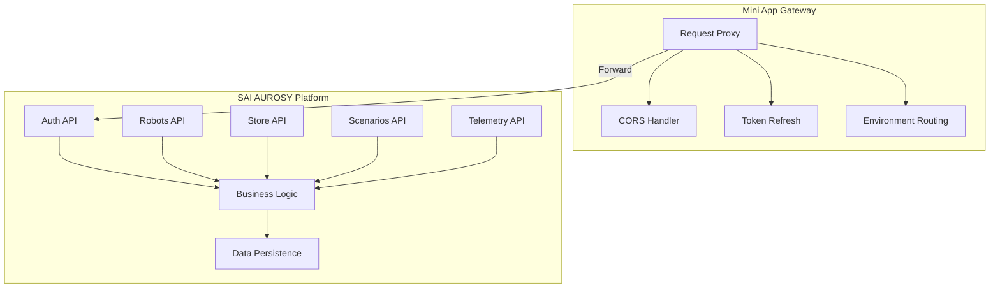
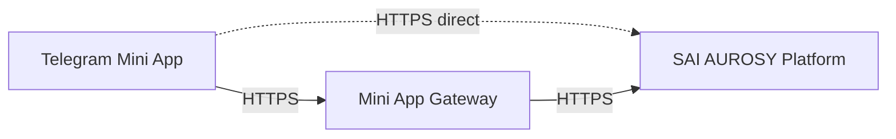

# Backend Architecture

## No Dedicated App Backend

The SAI AUROSY Telegram Mini App **does not have its own business-logic backend**. All backend logic—authentication, business rules, robot control, store, scenarios—lives in the **SAI AUROSY platform**.

An optional **Mini App Gateway** (BFF/proxy) may be deployed as infrastructure. It does not implement business logic or persist data; it only proxies requests and handles cross-cutting concerns (CORS, token refresh, routing).

## Gateway vs Platform

| Layer | Responsibility | Business Logic | Data Persistence |
|-------|----------------|----------------|------------------|
| **Mini App Gateway** | Proxy, CORS, token handling, env routing | No | No |
| **SAI AUROSY Platform** | Auth, robots, store, scenarios, telemetry | Yes | Yes |

## When Gateway Is Used

The Gateway is **optional**. Use it when:

| Scenario | Reason |
|----------|--------|
| **CORS restrictions** | Platform API does not allow direct browser requests from the Mini App origin |
| **Server-side token refresh** | Refresh flow requires a server-side step (e.g., secure cookie, token rotation) |
| **Multi-environment routing** | Different API URLs per environment (dev, staging, prod); Gateway routes to correct platform instance |
| **Request logging / rate limiting** | Centralized request logging or rate limiting per client |

When the Gateway is not used, the Mini App talks directly to the Platform API.

## Gateway Responsibilities

| Responsibility | Description |
|----------------|-------------|
| **Proxy requests** | Forward HTTP requests from Mini App to Platform API |
| **Attach/forward auth headers** | Pass through `Authorization` header; no token creation |
| **CORS** | Add CORS headers so browser allows cross-origin requests |
| **Token refresh (optional)** | Server-side refresh when platform requires it |
| **Environment routing** | Route to correct Platform API URL per environment |

The Gateway **must not**:

- Validate business rules
- Persist business data
- Connect to robots
- Implement scenario logic

## Platform Responsibilities

The SAI AUROSY platform provides:

- **Auth API** — Validates Telegram init data; issues sessions
- **Robots API** — Robot CRUD, connection, commands
- **Store API** — Catalog, acquisition
- **Scenarios API** — List, run, status
- **Telemetry API** — Robot status and telemetry

The platform is the single source of truth for users, robots, scenarios, and store data.

## Architecture Overview

- **With Gateway:** Mini App → Gateway → Platform
- **Without Gateway:** Mini App → Platform

## Summary

| Concern | Owner |
|---------|-------|
| Auth validation | Platform |
| Business logic | Platform |
| Robot control | Platform |
| Data persistence | Platform |
| API | Platform |
| Request proxy, CORS, token handling | Gateway (optional) |
| UI, routing, API client | App (frontend only) |
