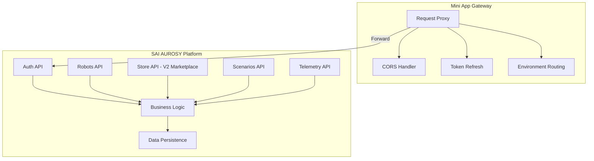
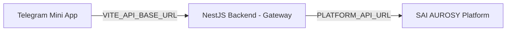

# Backend Architecture

## NestJS Backend as Gateway

This project includes a **NestJS backend** in `backend/` that implements the **Mini App Gateway** (BFF/proxy). The frontend **always** calls this backend; it never talks directly to the SAI AUROSY platform.

The backend does **not** implement business logic or persist data. All business logic—authentication, robot control, store, scenarios—lives in the **SAI AUROSY platform**. The backend:

- **Proxies** requests to the platform when `PLATFORM_API_URL` is set
- **Serves mock data** when `PLATFORM_API_URL` is unset (demo mode)
- Handles CORS, request forwarding, and auth header passthrough

```
Mini App → NestJS Backend (Gateway) → Platform API
```

## Gateway vs Platform



| Layer | Responsibility | Business Logic | Data Persistence |
|-------|----------------|----------------|------------------|
| **Mini App Gateway** | Proxy, CORS, token handling, env routing | No | No |
| **SAI AUROSY Platform** | Auth, robots, store, scenarios, telemetry | Yes | Yes |

## Gateway in This Project

In this project, the Gateway is **required**. The frontend uses `VITE_API_BASE_URL` to call the NestJS backend; there is no direct Mini App → Platform path. The backend:

| Scenario | Behavior |
|----------|----------|
| **`PLATFORM_API_URL` unset** | Returns mock data (auth, robots, store, scenarios, telemetry) for demo |
| **`PLATFORM_API_URL` set** | Proxies auth, robots, scenarios, telemetry to platform; Store remains mock |
| **CORS** | Backend enables CORS so the frontend can call it from any origin |
| **Path mapping** | Maps app paths to platform paths where needed (e.g. `/commands` → platform `/command`) |

## Gateway Responsibilities

| Responsibility | Description |
|----------------|-------------|
| **Proxy requests** | Forward HTTP requests from Mini App to Platform API |
| **Attach/forward auth headers** | Pass through `Authorization` header; no token creation |
| **CORS** | Add CORS headers so browser allows cross-origin requests |
| **Token refresh (optional)** | Server-side refresh when platform requires it |
| **Environment routing** | Route to correct Platform API URL per environment |

The Gateway **must not**:

- Validate business rules
- Persist business data
- Connect to robots
- Implement scenario logic

## Platform Responsibilities

The SAI AUROSY platform provides:

- **Auth API** — Validates Telegram init data; issues sessions
- **Robots API** — Robot CRUD, connection, commands
- **Store API** — V2 / Marketplace (Phase 3.4); V1 uses backend mock only
- **Scenarios API** — List, run, status
- **Telemetry API** — Robot status and telemetry

The platform is the single source of truth for users, robots, scenarios, and store data.

## Architecture Overview



- **Always:** Mini App → NestJS Backend → Platform (when `PLATFORM_API_URL` is set)
- **Demo mode:** Mini App → NestJS Backend → mock data (when `PLATFORM_API_URL` is unset)

## Summary

| Concern | Owner |
|---------|-------|
| Auth validation | Platform |
| Business logic | Platform |
| Robot control | Platform |
| Data persistence | Platform |
| API | Platform |
| Request proxy, CORS, token handling | NestJS Backend (Gateway) |
| UI, routing, API client | App (frontend only) |
