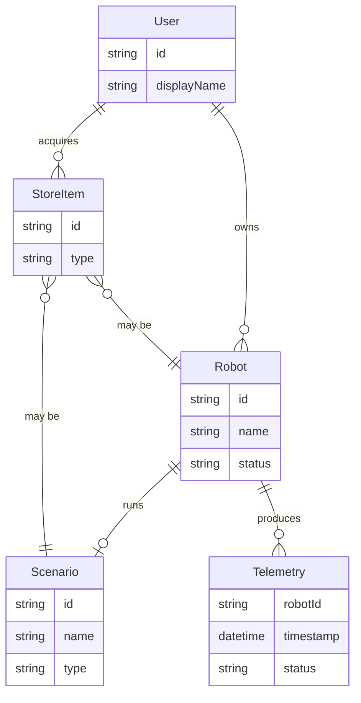

# Data Model

## Conceptual Entities

The app deals with the following entities. All are sourced from the SAI AUROSY platform API; the app does not persist business data.

### User

- **Source:** Platform (derived from Telegram init data)
- **Attributes:** ID, display name, linked Telegram ID (TBD)
- **Relationship:** Owns robots; has acquired store items and scenarios

### Robot

- **Source:** Platform API (`/robots`, `/robots/:id`)
- **Attributes:** ID, name, model, status, connection state, assigned scenario (if any)
- **Relationship:** Belongs to user; can run scenarios; produces telemetry

### Scenario

- **Source:** Platform API (`/scenarios`, `/scenarios/:id`)
- **Attributes:** ID, name, description, type (e.g., Mall Guide), compatibility
- **Relationship:** Can be run on robots; user may have acquired scenarios (V2)

### StoreItem

- **Source:** Platform API (`/store/items`)
- **Attributes:** ID, type (robot or scenario), name, description, price (if applicable)
- **Relationship:** User acquires items; acquired items become robots or scenarios in user's account

### Telemetry

- **Source:** Platform API (`/telemetry` or streaming)
- **Attributes:** Robot ID, timestamp, status, sensor data, position (TBD)
- **Relationship:** Associated with robot; streamed or polled

## Entity Relationship Diagram

## Data Source

| Data | Source | Persisted in App? |
|------|--------|-------------------|
| User profile | Platform | No (session only) |
| Robots | Platform API | No (fetched on demand) |
| Scenarios | Platform API | No |
| Store catalog | Platform API | No |
| Telemetry | Platform API / stream | No (display only) |

## Local State (App-Only)

The app may persist:

- **Session token** — For authenticated requests
- **UI preferences** — Theme, last selected robot (optional)
- **Cache** — Short-lived cache for list data (optional; invalidate on navigation)

No business data (robots, scenarios, store items) is persisted in the app. The platform is the source of truth.
