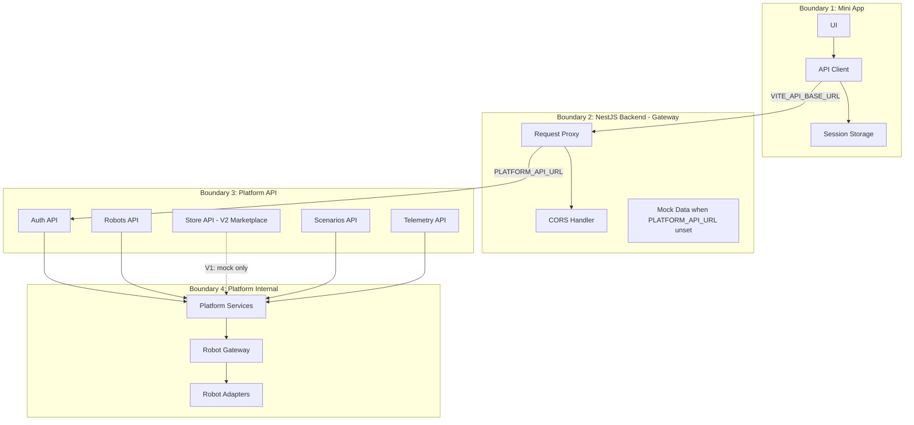
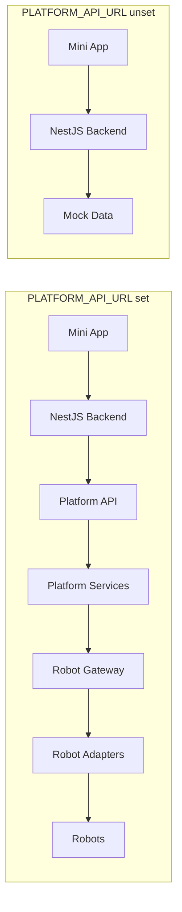
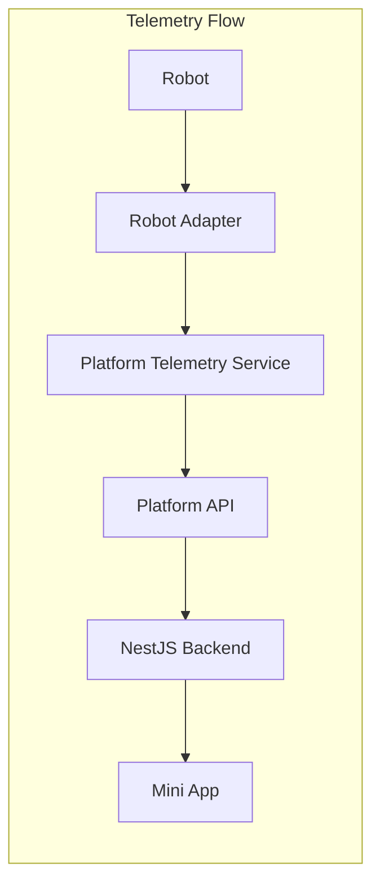
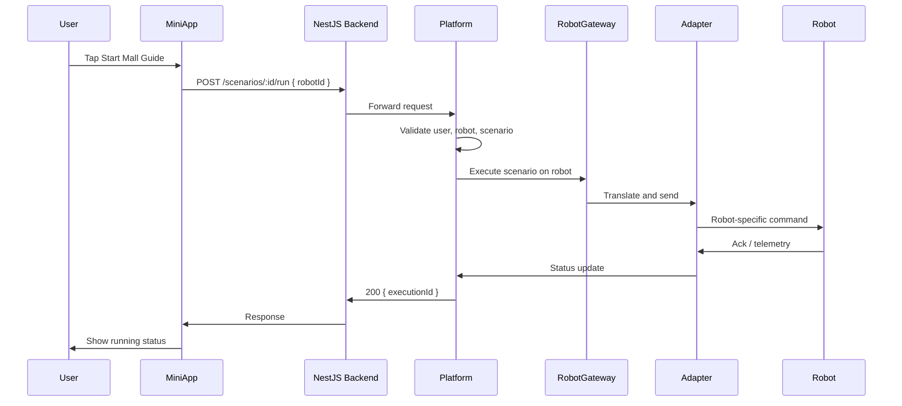
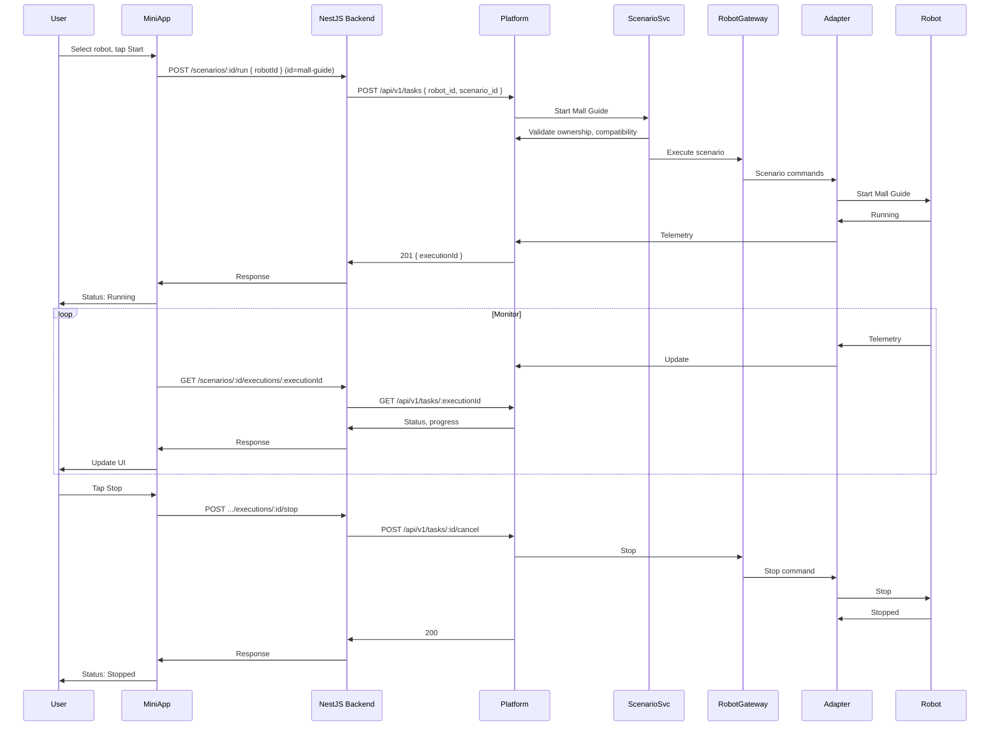

# Integration with SAI AUROSY Platform

See [Platform Reference](platform-reference.md) for platform project locations and integration principles. The Mini App does not create scenarios internally—the scenario engine runs on the platform. Mock data is used only when `PLATFORM_API_URL` is unset.

## Integration Pattern

The Mini App acts as an **API consumer**. It sends HTTP requests to the **NestJS backend** (Mini App Gateway) at `VITE_API_BASE_URL`. The backend proxies requests to the SAI AUROSY platform when `PLATFORM_API_URL` is set, or serves mock data when unset. The platform is the single source of truth for all business data and robot state.

**Path mapping:** The backend maps app paths to platform paths where they differ. For example, the app uses `POST /robots/:id/commands` while the SAI AUROSY platform uses `POST /robots/:id/command` (singular); the backend translates between them.

## Integration Boundaries

| Boundary | Components | Responsibility |
|----------|------------|----------------|
| **1. Mini App** | UI, API client, session | User interface, API calls, token storage |
| **2. NestJS Backend** | Proxy, CORS, mock data | Request forwarding, path mapping, mock when platform unset |
| **3. Platform API** | Auth, Robots, Scenarios, Telemetry; Store (V2 Marketplace) | API surface; Store in V1 is backend mock only |
| **4. Platform Internal** | Services, Robot Gateway, Adapters | Business logic, robot connectivity |

## Request Flow

In this project, the Mini App **always** calls the NestJS backend. The backend either proxies to the platform or serves mock data.

**With platform:** Mini App → NestJS Backend → Platform API → Platform Services → Robot Gateway → Robot Adapters → Robots

**Demo mode:** Mini App → NestJS Backend → mock data (no platform call)

The backend only proxies or serves mocks; it does not implement business logic or persist data.

## Telemetry Flow

Telemetry originates from robots and flows to the Mini App via the platform. The Mini App never receives telemetry directly from robots.

1. **Robot** — Sends telemetry (position, status, sensors) to the platform via its adapter
2. **Robot Adapter** — Receives robot-specific data; normalizes and forwards to platform
3. **Platform Telemetry Service** — Aggregates, stores, and exposes via API (stream or poll)
4. **Platform API** — Exposes `/telemetry/:robotId` or WebSocket stream
5. **NestJS Backend** — Proxies telemetry (or serves mock) to the Mini App
6. **Mini App** — Polls backend; displays status to user

## Commands and Scenario Launch Flow

User actions (e.g., send command, start Mall Guide) flow through the platform to robots.

See [Mall Guide Scenario Execution Sequence](#mall-guide-scenario-execution-sequence) below for the full flow.

## Mall Guide Scenario Execution Sequence

End-to-end sequence for launching and monitoring the Mall Guide scenario.

## Authentication Flow

See [Authentication and Security](auth-and-security.md) for the full Telegram authentication sequence with Bot and WebApp roles.

Summary: User opens Mini App from Telegram → App reads `initData` → App sends to NestJS backend → Backend forwards to Platform (when `PLATFORM_API_URL` set) → Platform validates HMAC → Platform issues session tokens → App stores and uses for API requests.

## API Domains

| Domain | Purpose |
|--------|---------|
| **Auth** | Login (init data), refresh, logout |
| **Robots** | List, get, connect, disconnect, commands |
| **Store** | List items, acquire (V1: backend mock only; platform Store API not implemented) |
| **Scenarios** | List, get, run (Mall Guide), status |
| **Telemetry** | Subscribe/stream or poll robot status |

See [API Overview](../api/api-overview.md) for details.

## Error Handling

- **401 Unauthorized** — Token expired or invalid; app should refresh or re-authenticate
- **403 Forbidden** — User lacks permission; show appropriate message
- **404 Not Found** — Resource does not exist or user has no access
- **5xx Server Error** — Platform issue; show retry or contact support
- **Network failure** — Show offline message; retry when connection restored

## Offline Behavior

- The app does not cache business data for offline use.
- When offline: show connection error, disable actions that require API.
- When back online: refresh data and re-enable actions.
- Session token may expire while offline; re-authenticate on next request if needed.

## Versioning and Compatibility

- Platform API version: TBD (e.g., `/v1/` prefix or `Accept-Version` header)
- App should declare supported API version.
- Breaking changes: platform to communicate deprecation; app to update before cutoff.
- Non-breaking changes: app should tolerate new fields and optional parameters.
