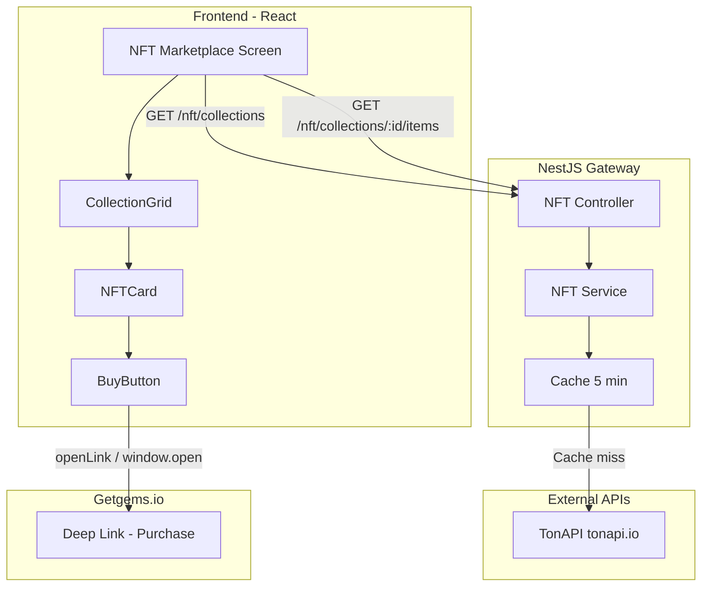

# NFT Marketplace Architecture (Read-Only MVP)

## Overview

The NFT Marketplace is a **Read-Only** feature inside the Telegram Mini App. It displays NFTs from whitelisted TON collections and redirects users to Getgems.io for purchases. No blockchain transactions or wallet signing occur within the app.

## Data Flow

- **Read**: Frontend → NestJS Backend → TonAPI (with 5-min cache)
- **Buy**: Frontend opens Getgems URL; user completes purchase on Getgems; returns to app manually

## Key Principles

| Principle | Implementation |
|-----------|----------------|
| No blockchain transactions | Buy button opens Getgems Deep Link only |
| No TonConnect for purchases | TonConnect used only for optional wallet display |
| No sensitive data storage | No wallet keys or purchase data on backend |
| Whitelist security | Only collections in `NFT_COLLECTION_WHITELIST` are served |
| Fresh data | 5-minute cache TTL for NFT data |

## Components

| Component | Location | Responsibility |
|-----------|----------|----------------|
| NFTCard | `frontend/src/components/nft/NFTCard.tsx` | Image, name, price, attributes, Buy button |
| CollectionGrid | `frontend/src/components/nft/CollectionGrid.tsx` | Responsive grid of NFTCard; loading skeleton |
| BuyButton | `frontend/src/components/nft/BuyButton.tsx` | Opens Getgems Deep Link |
| NFTDetailSheet | `frontend/src/components/nft/NFTDetailSheet.tsx` | Bottom sheet with full NFT info and Buy button |

## Getgems Deep Link

- **Collection-based**: `https://getgems.io/collection/{COLLECTION_ADDRESS}/{NFT_ADDRESS}?modalId=nft_buy&modalNft={NFT_ADDRESS}`
- **Single NFT**: `https://getgems.io/nft/{NFT_ADDRESS}?modalId=nft_buy&modalNft={NFT_ADDRESS}`

Addresses are converted to friendly (base64) format for Getgems URLs using `@ton/core`.

## Security

- **Collection whitelist**: `NFT_COLLECTION_WHITELIST` env var (comma-separated addresses)
- **Scam filtering**: Items with `trust === 'blacklist'` are excluded
- **No sensitive data**: No wallet keys or purchase state stored

## Related Documentation

- [NFT Marketplace API](../implementation/nft-marketplace-api.md)
- [Backend Architecture](backend-architecture.md)
- [Frontend Architecture](frontend-architecture.md)
