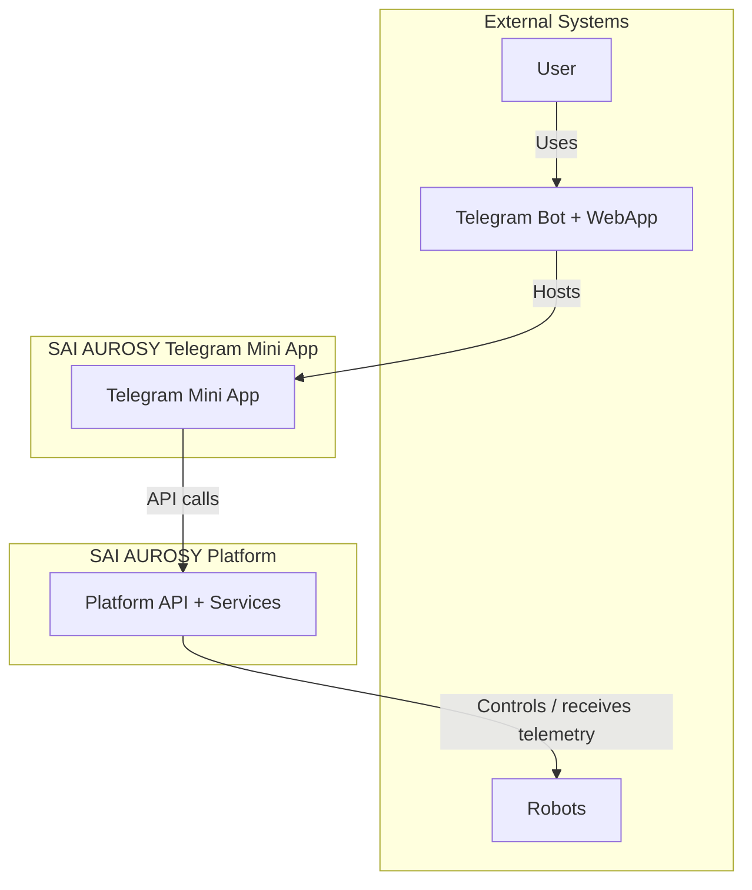
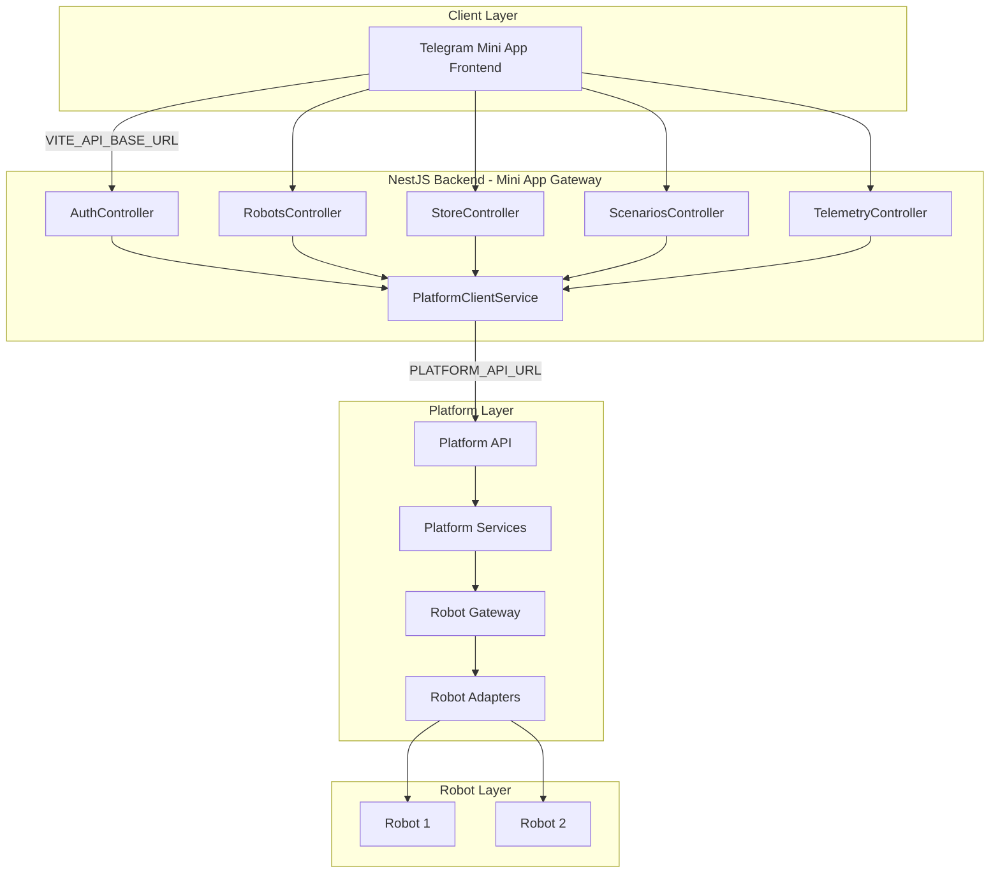
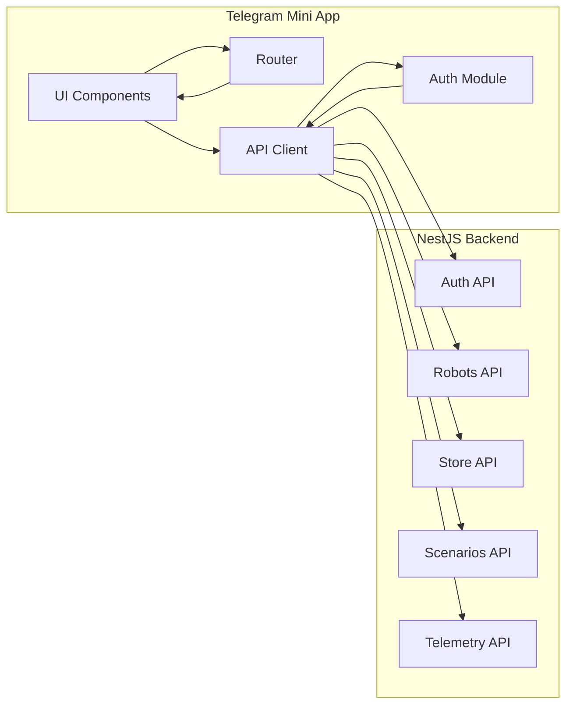

# System Architecture

## Overview

The SAI AUROSY Telegram Mini App is an **external client application** that runs inside Telegram. It provides a lightweight mobile interface for robot operations. The app communicates with the SAI AUROSY platform **via a NestJS backend** (Mini App Gateway) in `backend/`; the platform owns all business logic and robot connectivity.

**V1 Scope:** Robot connection, Store, Control Panel, and Mall Guide scenario.

## System Context Diagram (C4 Level 1)

Shows the Mini App as an external system and its relationships with users, Telegram, and the platform.



- **User** — Interacts with the Mini App through Telegram
- **Telegram** — Bot serves the WebApp URL; WebApp runtime provides init data, theme, viewport
- **Telegram Mini App** — External client; UI, API client, session management
- **SAI AUROSY Platform** — Backend; auth, business logic, robot control, data
- **Robots** — Connected via platform only; no direct app connection

## Container Diagram (C4 Level 2)

Shows the main containers and how they communicate. In this project, the Gateway is implemented as the **NestJS backend** in `backend/`.



- **Telegram Mini App Frontend** — External client; UI, routing, API client, auth module
- **NestJS Backend** — Mini App Gateway; Auth, Robots, Store, Scenarios, Telemetry controllers; proxies to platform or serves mock data
- **Platform API** — REST/GraphQL; auth, robots, store, scenarios, telemetry
- **Platform Services** — Business logic, auth validation, scenario execution
- **Robot Gateway** — Platform component that manages robot connections
- **Robot Adapters** — Platform adapters per robot type; translate platform commands to robot-specific protocols

## Responsibility Matrix

| Responsibility | Mini App Frontend | NestJS Backend (Gateway) | SAI AUROSY Platform | Robot Adapters |
|----------------|-------------------|--------------------------|---------------------|----------------|
| UI and routing | Yes | No | No | No |
| API client | Yes | No | No | No |
| Session storage | Yes | No | No | No |
| Telegram SDK integration | Yes | No | No | No |
| Request proxy / CORS | No | Yes | No | No |
| Token refresh (server-side) | No | Optional | Yes | No |
| Auth validation (initData) | No | No | Yes | No |
| Session issuance | No | No | Yes | No |
| Business logic | No | No | Yes | No |
| Robot control | No | No | Yes | Via platform |
| Telemetry aggregation | No | No | Yes | No |
| Data persistence | No | No | Yes | No |
| Robot protocol translation | No | No | No | Yes |

## Tier Responsibilities

### Mini App (Frontend)

- **UI** — Renders screens, handles user input
- **Telegram integration** — Reads init data, adapts to theme/viewport
- **API client** — Sends requests to NestJS backend (`VITE_API_BASE_URL`) with session token
- **Session management** — Stores and refreshes session; handles auth errors
- **No business logic** — Does not validate business rules, compute prices, or control robots

### NestJS Backend (Mini App Gateway)

- **Proxy** — Forwards requests to platform API when `PLATFORM_API_URL` is set
- **Mock data** — Serves in-memory mock data when `PLATFORM_API_URL` is unset (demo mode)
- **CORS** — Enables cross-origin requests from the frontend
- **Path mapping** — Maps app paths to platform paths (e.g. `/commands` → platform `/command`)
- **No business logic** — No validation, persistence, or robot control; platform is source of truth

### SAI AUROSY Platform

- **Auth validation** — Validates Telegram init data; issues and refreshes sessions
- **Business logic** — Robot ownership, store acquisition, scenario execution rules
- **Robot control** — Connects to robots via Robot Gateway and Adapters; sends commands; receives telemetry
- **Data persistence** — Users, robots, scenarios, store inventory, telemetry
- **API** — Exposes REST/GraphQL endpoints for the app

### Robot Adapters

- **Protocol translation** — Adapt platform commands to robot-specific protocols
- **Telemetry ingestion** — Receive robot telemetry and forward to platform
- **Platform-owned** — Part of the platform; not accessible by the Mini App

### Robots

- Receive commands from the platform (via adapters)
- Send telemetry and status to the platform
- Never communicate directly with the app

## Key Principle: No Direct Robot Connection

The app **never** connects to robots. All robot communication flows through the platform:

```
Mini App → NestJS Backend (Gateway) → Platform API → Platform Services → Robot Gateway → Robot Adapters → Robots
```

This keeps the app simple, secure, and aligned with platform policies. The platform is the **single source of truth**.

## Component Diagram (Mini App Internal)



The API client calls the NestJS backend at `VITE_API_BASE_URL`. The backend proxies to the SAI AUROSY platform when `PLATFORM_API_URL` is set.

## Related Documentation

- [Integration with SAI Platform](integration-with-sai-platform.md) — Request flow, telemetry, integration boundaries
- [Authentication and Security](auth-and-security.md) — Telegram auth sequence
- [Backend Architecture](backend-architecture.md) — Gateway vs Platform
- [Frontend Architecture](frontend-architecture.md) — Mini App structure and screens
