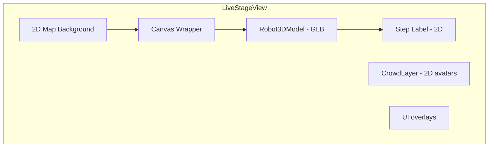

# Event Mode Demo

Architecture and implementation notes for the Event Mode Demo screen.

## Overview

The Event Mode Demo simulates an entertainment robot event on a mall map. A 3D GLB robot model is overlaid on a 2D map background, moves between waypoints, and displays step labels. Crowd avatars gather around the stage.

## Architecture

### Layer Order (z-index)

1. Map background (base)
2. CrowdLayer (z-10)
3. RobotStage / Canvas (z-20)
4. Step label (z-30, inside RobotStage)
5. Metrics and step progress UI

## Components

| Component | Path | Role |
|-----------|------|------|
| EventModeDemoScreen | `screens/demo/EventModeDemoScreen.tsx` | Route container; preloads GLB |
| LiveStageView | `screens/demo/LiveStageView.tsx` | Map, crowd, robot, UI layout |
| RobotStage | `screens/demo/RobotStage.tsx` | Canvas + perspective camera; step label |
| Robot3DModel | `screens/demo/Robot3DModel.tsx` | GLB loader, useAnimations, position, bounce |
| CrowdLayer | `screens/demo/CrowdLayer.tsx` | 2D visitor avatars |

## 3D Overlay

- **Approach:** Option A — 3D canvas overlay on 2D map
- **Camera:** Perspective, 3/4 view — `position: [0, 2.5, 4]`, `fov: 45`
- **Transparency:** `gl.setClearColor(0x000000, 0)` so map shows through
- **Model:** `/animated_robot_sdc.glb` via `useGLTF` from drei
- **Model rotation:** `rotationY` prop (radians) orients robot toward camera; default `Math.PI / 4`
- **Animation:** First available clip (e.g. "Scene") played via `useAnimations`; fallback to first animation if "Scene" is missing

### Coordinate Mapping

Waypoints use CSS percentages (`left`, `top`). Converted to scene coordinates:

- **x:** `(left - 50) / 50`
- **z:** `(50 - top) / 50`

### Waypoints

| Step | left% | top% | Label |
|------|-------|-----|-------|
| 0 | 35 | 30 | Robot greets visitors |
| 1 | 42 | 30 | Robot invites kids |
| 2 | 50 | 32 | Robot performs dance |
| 3 | 50 | 32 | Robot plays music |
| 4 | 62 | 30 | Robot takes photos |
| 5 | 50 | 34 | Robot thanks audience |

## Dependencies

- `three` — WebGL renderer
- `@react-three/fiber` — React renderer for Three.js
- `@react-three/drei` — Helpers (useGLTF)

## Performance

- GLB preloaded on demo route mount (`useGLTF.preload`)
- `dpr={[1, 2]}` caps device pixel ratio
- Canvas uses `pointer-events: none` to avoid blocking UI
