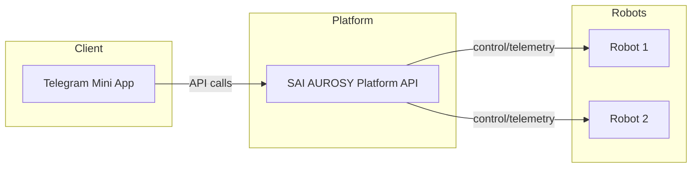

# Product Overview

## SAI AUROSY Telegram Mini App

**Tagline:** Lightweight mobile control for SAI AUROSY robots, inside Telegram.

## Definition

The SAI AUROSY Telegram Mini App is a lightweight mobile control interface for robot operations through Telegram. It provides visibility and control over robots managed by the SAI AUROSY platform, without requiring a dedicated mobile app.

## Relationship to SAI AUROSY Platform

This app is a **client layer** for the SAI AUROSY robotics platform. It is not part of the core platform repository. The platform owns all business logic, robot connectivity, and data; the app provides a user-facing interface that consumes platform APIs.

## Core Principles

- **Separate project** — Maintained in its own repository, independent of the core platform
- **API integration** — Connects to the platform via REST/GraphQL APIs only
- **No robot control logic** — All control logic remains in the platform
- **No direct robot connection** — The app never connects to robots; the platform mediates all robot communication
- **Extensible** — Designed to support additional scenarios and marketplace capabilities in future versions

## V1 Scope

1. **Robot Connection** — View and manage robots linked to the user's platform account
2. **Mall Guide Scenario** — Single scenario: launch, monitor, and stop Mall Guide
3. **Robot Store** — Browse and acquire robots from the platform store
4. **Control Panel** — View robot data and send commands

## V2 Scope (Planned)

5. **Marketplace** — Discovery and acquisition of scenarios developed by third parties
6. **Simulation & Preview** — Scenario simulation and robot execution preview

## Target Users

- **Robot operators** — Need quick access to robot status and control from mobile
- **Store managers** — Need simple onboarding to robot operations (Mall Guide focus)
- **Scenario developers** (V2) — Need a channel to distribute and monetize scenarios
