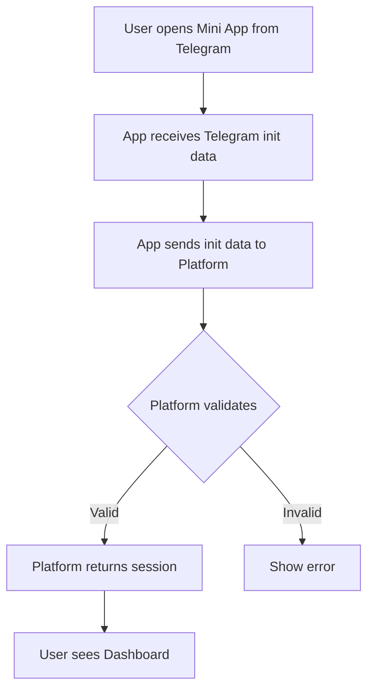
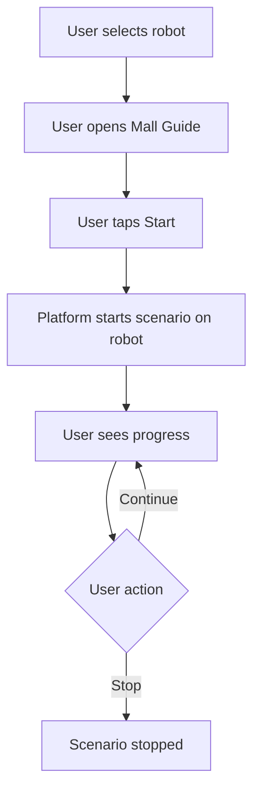

# User Flows

## Flow 1: First-Time User → Telegram Auth → Dashboard

1. User opens the Mini App from a Telegram bot or link.
2. Telegram injects init data (user, auth) into the Web App.
3. App sends init data to platform for validation.
4. Platform validates and returns a session token.
5. User lands on Dashboard with access to robots, store, and control.

## Flow 2: Connect Robot → Select Robot → Confirm Connection

1. User navigates to Robots screen.
2. User taps "Connect robot" or equivalent.
3. User selects robot from available/unclaimed list (or enters identifier).
4. User confirms connection.
5. Platform links robot to user's account.
6. Robot appears in user's fleet.

## Flow 3: Run Mall Guide → Select Scenario → Start → Monitor

1. User selects a connected robot.
2. User opens Mall Guide scenario view.
3. User taps Start.
4. Platform executes scenario on the robot.
5. User sees progress (status, telemetry).
6. User can stop scenario or let it complete.

## Flow 4: Robot Store → Browse → Select → Acquire

1. User opens Robot Store.
2. User browses catalog (grid or list).
3. User taps a robot to view details.
4. User taps Acquire.
5. Platform processes acquisition and adds robot to user's fleet.
6. User sees confirmation and robot in Robots screen.

## Flow 5: Control Panel → View Robot → Send Command

1. User opens Control Panel (or selects robot from Robots).
2. User sees robot info and telemetry.
3. User selects a command (e.g., move, stop, custom).
4. App sends command request to platform.
5. Platform executes on robot.
6. User sees updated status/telemetry.
