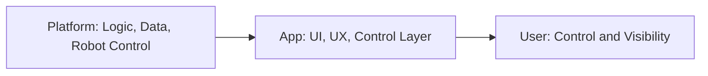

# Value Proposition

## For Robot Operators

- **Instant access** — Open the app from Telegram without installing anything; start managing robots in seconds
- **No app install** — Runs inside Telegram; no separate download or app store approval
- **Telegram-native** — Uses Telegram authentication; no separate login or password management
- **Mobile-first** — Optimized for on-the-go status checks and quick commands

## For Store Managers

- **Simple onboarding** — Focused interface for Mall Guide and core operations; minimal learning curve
- **Mall Guide focus** — V1 centers on one scenario to keep the experience clear and actionable
- **Visibility** — See robot status and scenario progress without navigating complex dashboards

## For the SAI AUROSY Platform

- **Extended reach** — Users who prefer Telegram can adopt the platform without leaving their workflow
- **Lower friction adoption** — Reduces barriers to trying and using robot operations
- **Complementary channel** — Adds a mobile control layer without replacing existing platform interfaces

## Value Chain

The platform owns logic, data, and robot control. The app provides the UI/UX and control layer. The user gains control and visibility over their robots through a lightweight, Telegram-based interface.
