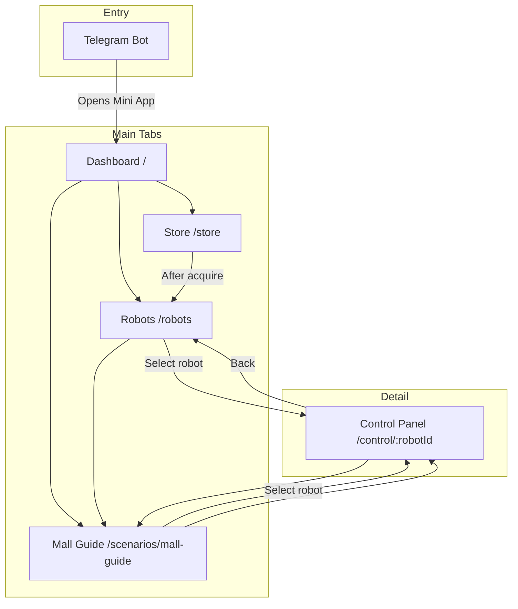
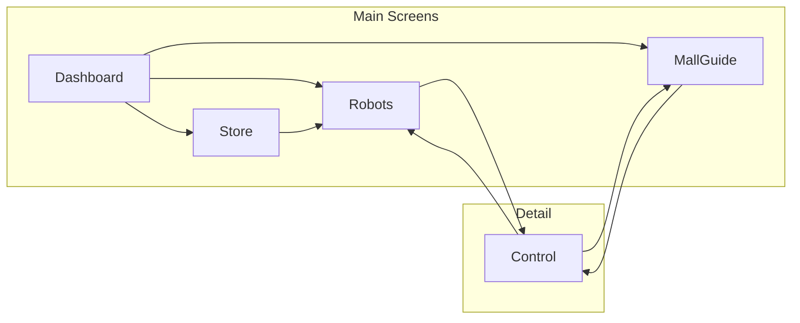

# Screen Map

## Screen Inventory

### V1 Screens

| Screen | Route | Purpose |
|--------|-------|---------|
| Dashboard | `/` | Entry point; quick links to main areas |
| Robots | `/robots` | List and manage connected robots |
| Store | `/store` | Browse and acquire robots |
| Control Panel | `/control/:robotId` | View robot data and send commands |
| Mall Guide | `/scenarios/mall-guide` | Run Mall Guide scenario |

### V2 Screens (Planned)

| Screen | Route | Purpose |
|--------|-------|---------|
| Marketplace | `/marketplace` | Browse and acquire scenarios |
| Simulation | `/simulation/:scenarioId` | Simulate scenario and preview execution |

## Screen Navigation Flow

## Navigation Matrix

| From | Reachable Screens |
|------|-------------------|
| **Dashboard** | Robots, Store, Mall Guide |
| **Robots** | Dashboard, Store, Mall Guide (via tabs), Control Panel (select robot), Mall Guide (run scenario) |
| **Store** | Dashboard, Robots, Mall Guide (via tabs), Robots (after acquire) |
| **Mall Guide** | Dashboard, Robots, Store (via tabs), Control Panel (select robot) |
| **Control Panel** | Robots, Mall Guide (via tabs or scenario shortcut) |

## Tab Bar / Menu (V1)

Primary navigation (tab bar or bottom menu):

- **Dashboard** — Home
- **Robots** — My robots
- **Store** — Robot Store
- **Mall Guide** — Quick access to Mall Guide

Control Panel is reached by selecting a robot from the Robots screen or from Mall Guide. It is a detail screen, not a tab.

## Entry Points

| Entry | Target Screen | Notes |
|-------|---------------|------|
| **Telegram bot menu** | Dashboard | User taps menu or button; opens Mini App |
| **Bot commands** | Dashboard or specific screen | Inline buttons may open app (TBD) |
| **Deep link** | Specific screen (e.g., `/robots`, `/store`) | TBD; direct link to screen |

## Back Navigation

### Telegram Back Button Behavior

| Screen Type | Back Button | Action |
|-------------|-------------|--------|
| **Dashboard** | Hidden | Root screen; no back |
| **Robots, Store, Mall Guide** | Hidden | Tab screens; switch via tabs |
| **Control Panel** | Visible | Back to Robots or Mall Guide (previous screen) |
| **Store item detail** | Visible | Back to Store catalog |
| **Modal / overlay** | Visible or in-app | Close modal |

### Navigation Rules

- Use `window.Telegram.WebApp.BackButton` when inside a detail screen (e.g., Control Panel)
- Show Back Button when navigation stack depth > 1
- Hide Back Button when at root or tab level
- From Control Panel: back goes to Robots or Mall Guide depending on entry path

## Screen Transitions (Simplified)

