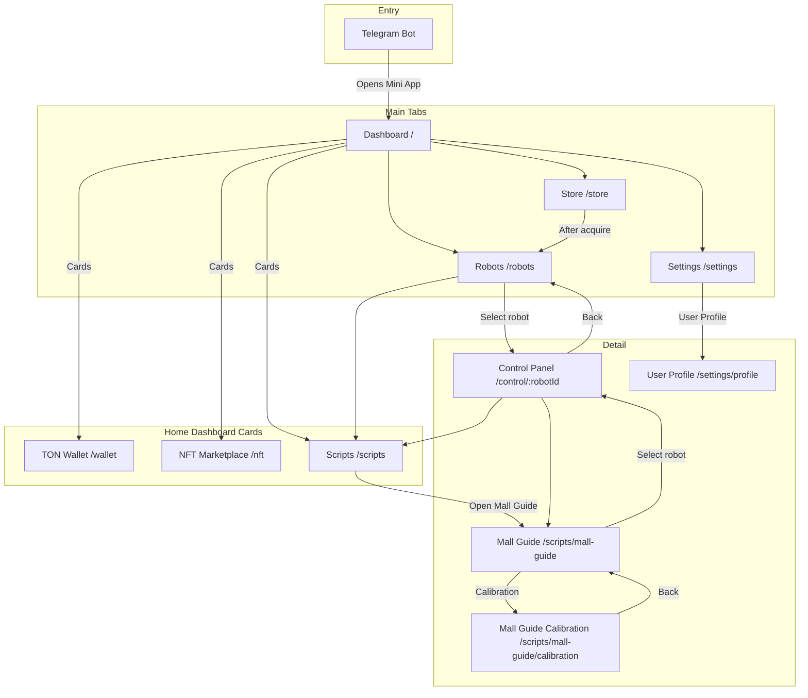
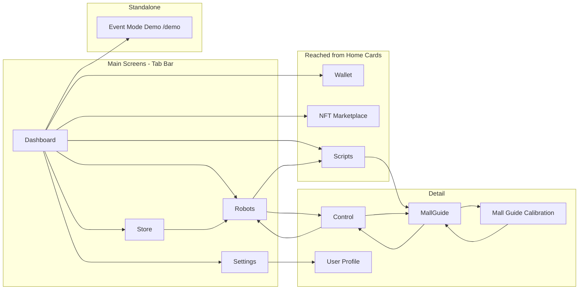

# Screen Map

## Screen Inventory

### V1 Screens

| Screen | Route | Purpose |
|--------|-------|---------|
| Dashboard | `/` | Entry point; quick links to main areas |
| Robots | `/robots` | List and manage connected robots |
| Store | `/store` | Browse and acquire robots |
| TON Wallet | `/wallet` | Connect TON wallet, view address, mock actions |
| Settings | `/settings` | App settings menu: User Profile, Theme toggle, Language selector |
| User Profile | `/settings/profile` | View Telegram user data when authenticated; login prompt when not |
| Control Panel | `/control/:robotId` | View robot data and send commands |
| Scripts | `/scripts` | Browse scripts by type (Behavioral, Speech, Hybrid) |
| Mall Guide | `/scripts/mall-guide` | Run Mall Guide script |
| Mall Guide Calibration | `/scripts/mall-guide/calibration` | Calibrate mall floor plan |
| Event Mode Demo | `/demo` | 3D robot demo on map overlay (standalone, outside main layout) |
| NFT Marketplace | `/nft` | Browse NFTs from whitelisted collections; Buy redirects to Getgems |

### V2 Screens (Planned)

| Screen | Route | Purpose |
|--------|-------|---------|
| Marketplace | `/marketplace` | Browse and acquire scenarios |
| Simulation | `/simulation/:scenarioId` | Simulate scenario and preview execution |

## Screen Navigation Flow

## Navigation Matrix

| From | Reachable Screens |
|------|-------------------|
| **Dashboard** | Robots, Store, Settings (via tabs), Wallet, NFT Marketplace, Scripts, Event Mode Demo (via cards) |
| **Robots** | Dashboard, Store, Settings (via tabs), Control Panel (select robot), Scripts (run script) |
| **Store** | Dashboard, Robots, Settings (via tabs), Robots (after acquire) |
| **Wallet** | Dashboard (via Home card or Back Button) |
| **NFT Marketplace** | Dashboard (via Home card or Back Button) |
| **Scripts** | Dashboard (via Home card or Back Button), Mall Guide (open script) |
| **Settings** | Dashboard, Robots, Store (via tabs), User Profile |
| **User Profile** | Settings (back) |
| **Mall Guide** | Scripts (back), Mall Guide Calibration, Control Panel (select robot) |
| **Mall Guide Calibration** | Mall Guide (back) |
| **Control Panel** | Robots, Scripts (via tabs or scenario shortcut), Mall Guide |
| **Event Mode Demo** | Dashboard (back) |

## Tab Bar / Menu (V1)

Primary navigation (tab bar, 4 items):

- **Home** — Dashboard (route `/`); cards link to Event Mode Demo, Store, Scripts, NFT Marketplace, TON Wallet
- **Robots** — My robots
- **Store** — Robot Store
- **Settings** — App settings (User Profile, Theme toggle, Language selector)

**Reached from Home cards (not in tab bar):**

- **NFT Marketplace** — `/nft`; card on Dashboard
- **TON Wallet** — `/wallet`; card on Dashboard
- **Scripts** — `/scripts`; card on Dashboard

Control Panel is reached by selecting a robot from the Robots screen or from Mall Guide. Mall Guide is reached from Scripts; Mall Guide Calibration is a sub-screen of Mall Guide. All are detail screens, not tabs.

## Entry Points

| Entry | Target Screen | Notes |
|-------|---------------|------|
| **Telegram bot menu** | Dashboard | User taps menu or button; opens Mini App |
| **Bot commands** | Dashboard or specific screen | Inline buttons may open app (TBD) |
| **Deep link** | Specific screen (e.g., `/robots`, `/store`) | TBD; direct link to screen |
| **Event Mode Demo** | `/demo` | Standalone route; no tab bar; reached from Dashboard link |
| **Redirect** | `/scripts/mall-guide` | `/scenarios/mall-guide` redirects to `/scripts/mall-guide` |

## Back Navigation

### Telegram Back Button Behavior

| Screen Type | Back Button | Action |
|-------------|-------------|--------|
| **Dashboard** | Hidden | Root screen; no back |
| **Robots, Store, Settings** | Hidden | Tab screens; switch via tabs |
| **Wallet, NFT Marketplace, Scripts** | Hidden | Reached from Home cards; use Back Button or tap Home |
| **User Profile** | Hidden | In-app back link to Settings |
| **Control Panel** | Visible | Back to Robots or Mall Guide (previous screen) |
| **Store item detail** | In-app | Modal overlay on Store screen; no separate route; close via in-app button |
| **Mall Guide Calibration** | Visible or in-app | Back to Mall Guide |
| **Modal / overlay** | Visible or in-app | Close modal |

### Navigation Rules

- Use `window.Telegram.WebApp.BackButton` when inside a detail screen (e.g., Control Panel)
- Show Back Button when navigation stack depth > 1
- Hide Back Button when at root or tab level
- From Control Panel: back goes to Robots or Scripts/Mall Guide depending on entry path

## Screen Transitions (Simplified)

