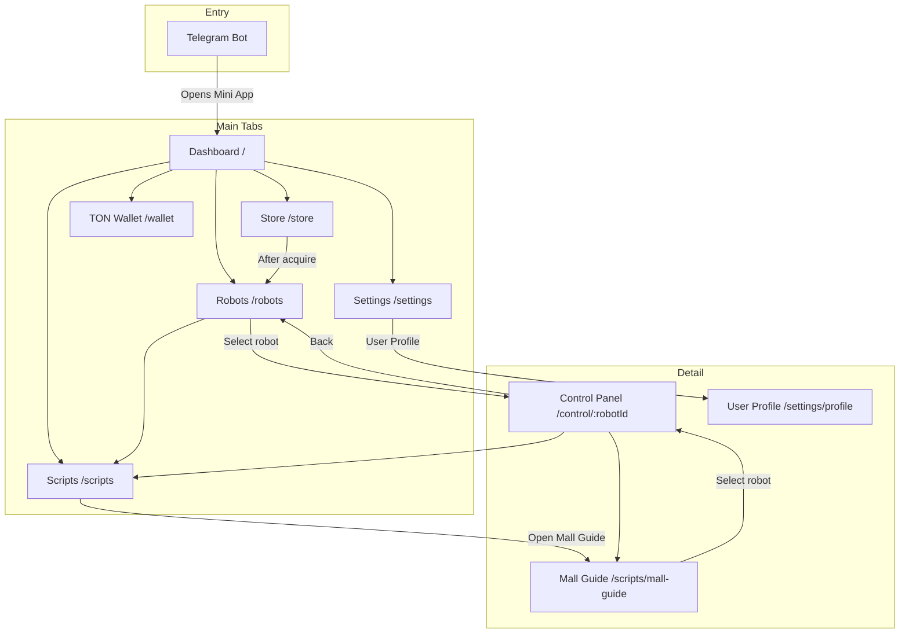
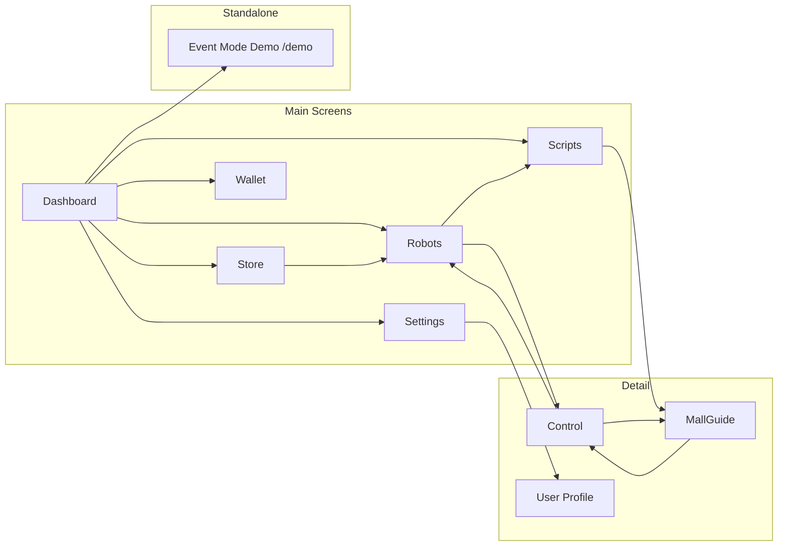

# Screen Map

## Screen Inventory

### V1 Screens

| Screen | Route | Purpose |
|--------|-------|---------|
| Dashboard | `/` | Entry point; quick links to main areas |
| Robots | `/robots` | List and manage connected robots |
| Store | `/store` | Browse and acquire robots |
| TON Wallet | `/wallet` | Connect TON wallet, view address, mock actions |
| Settings | `/settings` | App settings menu: User Profile, Theme toggle, Language selector |
| User Profile | `/settings/profile` | View Telegram user data when authenticated; login prompt when not |
| Control Panel | `/control/:robotId` | View robot data and send commands |
| Scripts | `/scripts` | Browse scripts by type (Behavioral, Speech, Hybrid) |
| Mall Guide | `/scripts/mall-guide` | Run Mall Guide script |
| Event Mode Demo | `/demo` | 3D robot demo on map overlay (standalone, outside main layout) |

### V2 Screens (Planned)

| Screen | Route | Purpose |
|--------|-------|---------|
| Marketplace | `/marketplace` | Browse and acquire scenarios |
| Simulation | `/simulation/:scenarioId` | Simulate scenario and preview execution |

## Screen Navigation Flow

## Navigation Matrix

| From | Reachable Screens |
|------|-------------------|
| **Dashboard** | Robots, Store, Wallet, Scripts, Settings, Event Mode Demo |
| **Robots** | Dashboard, Store, Wallet, Scripts, Settings (via tabs), Control Panel (select robot), Scripts (run script) |
| **Store** | Dashboard, Robots, Wallet, Scripts, Settings (via tabs), Robots (after acquire) |
| **Wallet** | Dashboard, Robots, Store, Scripts, Settings (via tabs) |
| **Scripts** | Dashboard, Robots, Store, Wallet, Settings (via tabs), Mall Guide (open script) |
| **Settings** | Dashboard, Robots, Store, Wallet, Scripts (via tabs), User Profile |
| **User Profile** | Settings (back) |
| **Mall Guide** | Scripts (back), Control Panel (select robot) |
| **Control Panel** | Robots, Scripts (via tabs or scenario shortcut), Mall Guide |
| **Event Mode Demo** | Dashboard (back) |

## Tab Bar / Menu (V1)

Primary navigation (tab bar or bottom menu):

- **Dashboard** — Home
- **Robots** — My robots
- **Store** — Robot Store
- **TON** — TON wallet connection and actions
- **Scripts** — Browse and run scripts
- **Settings** — App settings (User Profile, Theme toggle, Language selector)

Control Panel is reached by selecting a robot from the Robots screen or from Mall Guide. Mall Guide is reached from Scripts. Both are detail screens, not tabs.

## Entry Points

| Entry | Target Screen | Notes |
|-------|---------------|------|
| **Telegram bot menu** | Dashboard | User taps menu or button; opens Mini App |
| **Bot commands** | Dashboard or specific screen | Inline buttons may open app (TBD) |
| **Deep link** | Specific screen (e.g., `/robots`, `/store`) | TBD; direct link to screen |
| **Event Mode Demo** | `/demo` | Standalone route; no tab bar; reached from Dashboard link |

## Back Navigation

### Telegram Back Button Behavior

| Screen Type | Back Button | Action |
|-------------|-------------|--------|
| **Dashboard** | Hidden | Root screen; no back |
| **Robots, Store, Wallet, Scripts, Settings** | Hidden | Tab screens; switch via tabs |
| **User Profile** | Hidden | In-app back link to Settings |
| **Control Panel** | Visible | Back to Robots or Mall Guide (previous screen) |
| **Store item detail** | Visible | Back to Store catalog |
| **Modal / overlay** | Visible or in-app | Close modal |

### Navigation Rules

- Use `window.Telegram.WebApp.BackButton` when inside a detail screen (e.g., Control Panel)
- Show Back Button when navigation stack depth > 1
- Hide Back Button when at root or tab level
- From Control Panel: back goes to Robots or Scripts/Mall Guide depending on entry path

## Screen Transitions (Simplified)

